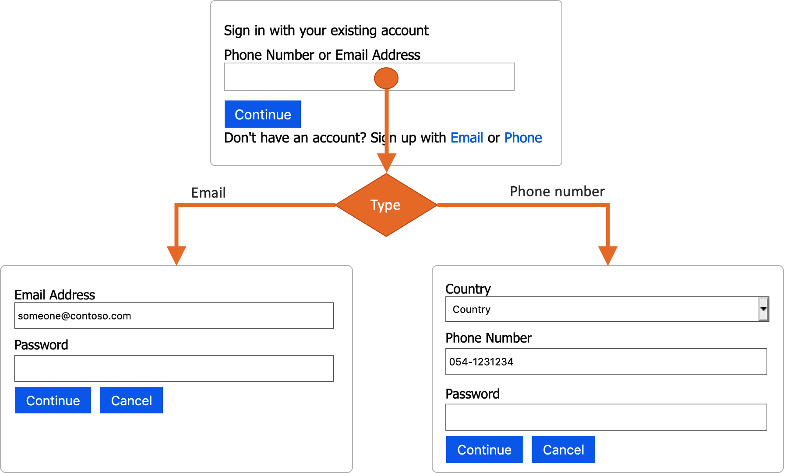
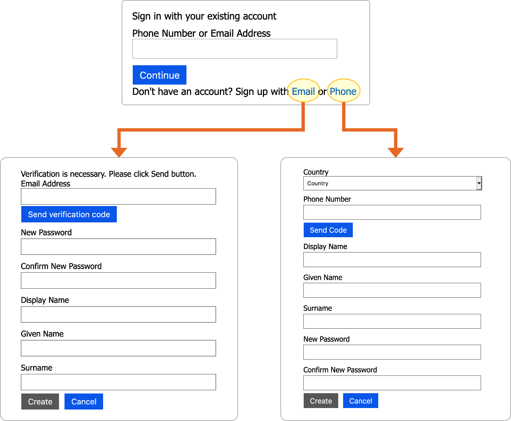

# Sign-up or sign-in with email or phone number

## Contributing

This project has adopted the [Microsoft Open Source Code of Conduct](https://opensource.microsoft.com/codeofconduct/). For more information, see the [Code of Conduct FAQ](https://opensource.microsoft.com/codeofconduct/faq/) or contact [opencode@microsoft.com](mailto:opencode@microsoft.com) with any additional questions or comments.

## This feature is in private preview

Using phone number as a username in Azure AD B2C is currently in private preview. These files are intended for only those who have been given explicit permission from the Azure AD B2C product team to use the feature. If you would like to try out the private preview, please email aadb2cpreview@microsoft.com.

## Sign-up or sign-in flow

To sign-in, user provides an email address or phone number, then clicks continue. Based on the input, the user is taken to the next page, to validate the credentials. 

User can sign-up with Email or Phone. 

