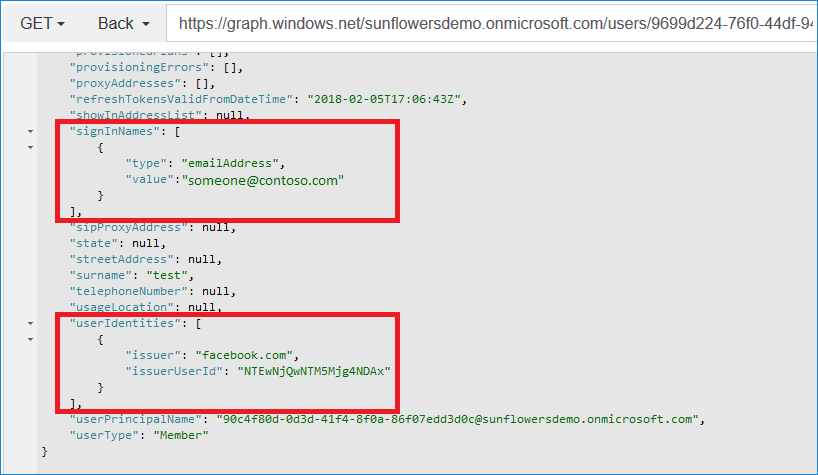

# Azure AD B2C account linkage

This Azure AD B2C sample demonstrates how to link existing local account to a social account. To link the local account to social account, user fist sign in with the local account (only).

After successful sign-in with local account, the policy shows the identity provider selection (without local account). User has to select one of the social accounts to link. Clicking on one of the social account buttons, redirects the user to the corresponding identity provider, to complete the login.

> Note:  If a user reruns this flow again. The new selected social account overwrites the previews one.

After successful login with one of the social accounts, the policy persists the newly social account into the local account with the object ID. Following screenshot demonstrates the user's data after the account linkage, using Graph API GET request `https://graph.windows.net/sunflowersdemo.onmicrosoft.com/users/user-object-id`. 
* **signInNames** attribute represents the local account sing in name or email address
* **userIdentities** attribute represents the social account

> Note:  This sample policy is based on [SocialAndLocalAccounts starter pack](../../../SocialAndLocalAccounts). All changes are marked with **Demo:** comment inside the policy XML files.
